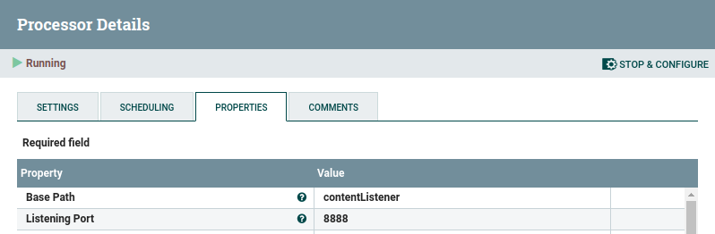
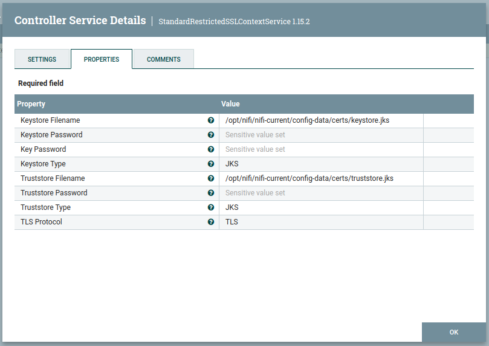

# Apache NiFi on OpenShift


Apache NiFi supports powerful and scalable directed graphs of data routing, transformation, and system mediation logic.
Ref: <https://nifi.apache.org/>

This repo provides tools and instructions for deploying and using Apache Nifi on OpenShift, witht the following characteristics:

* **UBI8-OpenJDK11 base images** for all NiFi components (main app, registry,toolkit).
* Container images conform to OpenShift standards, especially **without requiring scc** (standard provided images had to run as AnyUID).
* External Zookeer deployed automatically (Bitnami Zookeeper images are used).
* Cluster-mode enabled, with a default to 3 NiFi nodes (1 to 5 nodes available as overlays).
* Registry enabled to manage and version workflows.
* **Secured Route** automatically created (Re-Encrypt base on self-signed NiFi certificate).
* Single-User authentication mechanism by default, **LDAP** and **OIDC** available as overlays.

## Architecture

Several components are deployed to cover as many use cases as possible:

* Nifi CA: generates certificates for secured internal communication and authentication.
* Nifi Registry: provides a central location for storage and management of shared resources across one or more instances of NiFi and/or MiNiFi. For exxample, allows workflow versioning and change tracking.
* Zookeeper: an external zookeeper is deployed to allow flexibility and customization of the manifest.
* NiFi: statefulset deployment, with several parameters available (see below).

When deployed, a secured Route is automatically created, with reencryption using the certificate emitted by NiFi-CA. Put otherwise, it's a no touch setup, everything is taken care of.

## Deployment

There are tons of parameters that you can play with in Apache NiFi. Therefore, instead of providing an Helm chart and trying to expose and maintain all those parameters to cover every specific use cases, I chose to use Kustomize definitions and provide different base deployments for different authentication mechanisms and cluster sizes. Those "base examples" are then easy to modify for your own needs.

Here are the steps to follow:

* Create the namespace where you want to deploy Apache Nifi.
* From the `deployment` folder, edit the file `base/kustomization.yaml` and replace the `namespace` variable to match the name you want.
* Edit the file `base/params.env` and fill in the information (description for each variable is in the main README).
* Switch to the `base` folder or to the **overlay** you want to use.
* Use kustomize to build the deployment:

```bash
kustomize build -o /path/to/output/folder
```

* From the build folder, do `oc apply -f .` to deploy Nifi!

Alternative method: with a recent version of OpenShift (=>4.8), you can also do direcly `oc apply -k .` instead of the build + apply

## Parameters

The base configuration deploys a NiFi cluster with a SingleUser authentication mechanism, and 3 nodes. You can modify the following parameters in `params.env`:

* `storage_class`: storage class to use for the Persistent Volumes that are created.
* `admin_identity`: username for the SingleUser authentication.
* `admin_password`: password (**12 characters minimum, otherwise the deployment will fail!**) for the SingleUser authentication.
* `certificate_store_password`: the password used for the KeyStore and TrustStore (needed to create SSL contexts for components like listenHTTP)
* `uid`: a uid that will be used by the root schema and base flow of the installation (you can easily generate one on <https://www.uuidgenerator.net/version4>).

NOTE: don't modify the nodes_number directly in the `params.env` file! Use one of the overlays to modify the number of nodes.

## Overlays

### Nodes number

Different overlays are available, named `replicas-1` to `replicas-5`. They allow you to deploy the NiFi cluster with more or less nodes than the default 3.

### OIDC authentication

To enable OIDC authentication, you can use the overlay `oidc`.

Supplemental parameters to change in `params.env`:

* `oidc_discovery_url`: Full adress for the `.well-known/openid-configuration` standard discovery file. In case of using a provider running inside the cluster (e.g. a deployment of Keycloak), it has to be the full external secured Route).
* `oidc_client_id`: Client ID from the OIDC configuration.
* `oidc_client_secret`: Client Secret from the OIDC configuration
* `oidc_claim_identifying_user`: the claim in the returned Token that will be used to identify users (like `email`). Specific to your OIDC provider.

Full reference: <https://nifi.apache.org/docs/nifi-docs/html/administration-guide.html#openid_connect>

### LDAP Authentication

To enable LDAP authentication, you can use the overlay `ldap`.

Supplemental parameters to change in `params.env`:

* `ldap_host`: Full address to the LDAP host, with port
* `ldap_admin`: BindDN account to use to connect
* `ldap_pass`: BindDN account password
* `ldap_searchBase`: LDAP Search base for user accounts
* `ldap_searchFilter`: Filter users, based on groups for example
* `ldap_userIdentityAttribute`: Attribute identifying the user in its fully distinguished name.
* `ldap_userIdentityMapping`: Allows to keep only the username (or parts of it) to create the account in NiFi.

Full reference: <https://nifi.apache.org/docs/nifi-docs/html/administration-guide.html#ldap_login_identity_provider>

## Other recipes

### HTTP Listeners

The ListenHTTP component (like others) can open an http(s) port where you can send information directly into a workflow. To enable this functionality, you can apply the following recipe.

1. Modify the Nifi StatefulSet at the container definition level to add the ports you want to use for the listener(s). Example:

```yaml
ports:
    - name: metrics
        containerPort: 9092
        protocol: TCP
    - name: https
        containerPort: 9443
        protocol: TCP
    - name: cluster
        containerPort: 6007
        protocol: TCP
    - name: httplistener
        containerPort: 8888
        protocol: TCP
```

2. Create a Service to connect to the pods on this port. Example:

```yaml
kind: Service
apiVersion: v1
metadata:
  name: nifi-httplistener
  namespace: nifi
spec:
  ports:
    - name: httplistener
      protocol: TCP
      port: 8888
      targetPort: 8888
  selector:
    app: nifi
```

3. Create a Route to connect to the service, with SSL or not. SSL in this example:

```yaml
kind: Route
apiVersion: route.openshift.io/v1
metadata:
  name: nifi-httplistener
  namespace: nifi
spec:
  to:
    kind: Service
    name: nifi-httplistener
  port:
    targetPort: httplistener
  tls:
    termination: edge
    insecureEdgeTerminationPolicy: Redirect
  wildcardPolicy: None
```

4. In NiFi, create the listener, configured on the port you defined at 1.



5. (Optional) When using SSL, you have to define an SSL Context Service that will use the local certificates created during the deployment.



The following properties are used. All the stores have the same password, set at deployment, to allow the configuration of the service, which is unique in the cluster, to work on all nodes.

* Keystore Filename: `/opt/nifi/nifi-current/config-data/certs/keystore.jks`
* Keystore Password: the `certificate_store_password` parameter you set in the `params.env` file for deployment.
* Key Password: the `certificate_store_password` parameter you set in the `params.env` file for deployment.
* Keystore Type: `JKS`
* Trustore Filename: `/opt/nifi/nifi-current/config-data/certs/truststore.jks`
* Truststore Password: the `certificate_store_password` parameter you set in the `params.env` file for deployment.
* Trustore Type: `JKS`
* TLS Protocol: `TLS`
